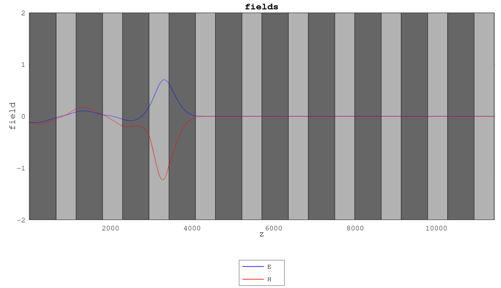
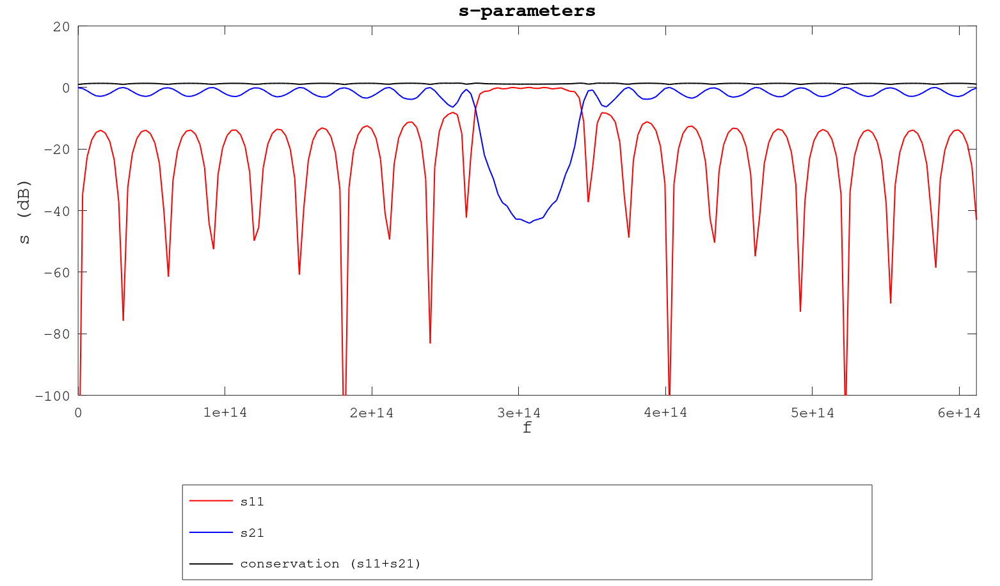

# fdtd.m

This repo contains FDTD EM Solver Implementations I created using MATLAB while I was following the lectures of [Dr. Raymond Rumpf](https://empossible.net/).

The implementations are as follows:

# fdtd_1d

1D FDTD implementation. This is a complete (but without dispersion correction and lossy material support) implementation in 1-dimension:

- Implements a perfect boundary condition (no reflections)
- Uses a TF/SF source at z=2
- Measures reflectance at z=1
- Measures transmittance at the last z
- There are 10 (spacer_region variable in fdtd_init function) spacer regions (vacuum) before and after the actual structure given.

During the simulation, a plot showing Ey and Hx waves are updated in real-time, the layers of the structure are also shown in gray colors in this plot. At the end of the simulation, fourier (frequency) analysis results are also plotted.

There is also a simple 3D plot functionality but it is commented out.

Below are plots while and at the end of running fdtd_demo3:

## Differences from the lecture

There are two optimizations in the implementation comparing to the lectures:

- The inner E and H update iterations (in space) are replaced by vectoral implementations. This is obviously faster.

- Update coefficients mEy and mHx are also divided by dz since this is also a loop-invariant.

- Fourier kernels (K) are pre-computed but also multiplied at each time iteration (Kc) in order to not run power operation (^T) as in the lectures.

- Fourier calculation iterations (in frequency) are also replaced by vectoral implementations.

- The frequency domain plots are given as s-parameters, in dB, rather than plain power ratios of reflection/transmittance to source.

## Demos

There are three demos (also based on the examples from the lectures):

- fdtd_demo1: single region
- fdtd_demo2: anti-reflection layers
- fdtd_demo3: bragg gratings